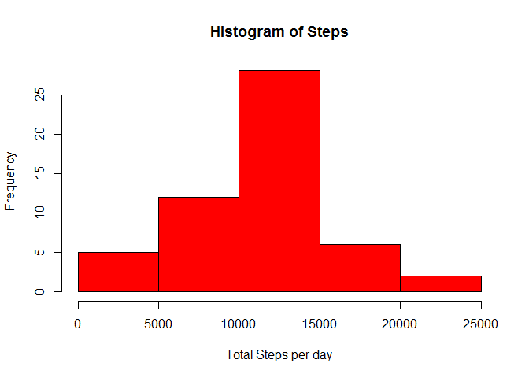

# Reproducible Research: Peer Assessment 1

##ReproducibleResearch Course Project1 - Arun Kumar Madas


##Loading and preprocessing the data

1. Load the data (i.e. read.csv())

```r
setwd("C:/Arun/docs/dsc_jhu/5_Reproducible_Research/week2/courseassignment1")
entireData <- read.csv("activity.csv", colClasses="character")
```

2. Process/transform the data (if necessary) into a format suitable for your analysis

```r
entireData[,1]<-suppressWarnings(as.numeric(entireData[,1]))
entireData[,3]<-suppressWarnings(as.numeric(entireData[,3]))
```

##What is mean total number of steps taken per day?

For this part of the assignment, you can ignore the missing values in the dataset.

```r
activityData <- na.omit(entireData)
```

1. Calculate the total number of steps taken per day

```r
dateWiseTotalSteps <- aggregate(steps ~ date, activityData, sum)
```


2. Make a histogram of the total number of steps taken each day

```r
hist(dateWiseTotalSteps$steps,main="Histogram of Steps",xlab="Total Steps per day",col="Red")
```

 


3: Calculate and report the mean and median of the total number of steps taken per day

```r
mean(dateWiseTotalSteps$steps)
```

```
## [1] 10766.19
```

```r
median(dateWiseTotalSteps$steps)
```

```
## [1] 10765
```


#What is the average daily activity pattern?

1. Make a time series plot (i.e. type = "l") of the 5-minute interval (x-axis) and the average number of steps taken, averaged across all days (y-axis)

```r
avgstepsinterval <- aggregate(steps ~ interval, activityData, mean)
avgstepsinterval[,1] <- as.numeric(avgstepsinterval[,1])
avgstepsinterval <- avgstepsinterval[order(avgstepsinterval$interval),]
plot(avgstepsinterval[,1],avgstepsinterval[,2],type="l",main="Average Steps across 5-min Intervals",xlab="5 min Interval",ylab="Average No. of Steps",col="Red", xaxt="n")
xticks<-seq(0,2500,by=50)
axis(1, at=xticks)
```

 

2. Which 5-minute interval, on average across all the days in the dataset, contains the maximum number of steps?

```r
avgstepsinterval[which.max(avgstepsinterval[,2]),1]
```

```
## [1] 835
```

#Imputing missing values

Note that there are a number of days/intervals where there are missing values (coded as NA). The presence of missing days may introduce bias into some calculations or summaries of the data.

1. Calculate and report the total number of missing values in the dataset (i.e. the total number of rows with NAs)


```r
nrow(entireData[is.na(entireData[,1]),])
```

```
## [1] 2304
```

2. Devise a strategy for filling in all of the missing values in the dataset. The strategy does not need to be sophisticated. For example, you could use the mean/median for that day, or the mean for that 5-minute interval, etc.

Strategy is to fill in the missing values with mean for that day.


```r
#Calcualte the mean per day excluding NA values in the data set
meanDateWise <- aggregate(steps ~ date, activityData, mean)
uniqueNADates <- unique((entireData[is.na(entireData[,1]),])[,2])
```

3. Create a new dataset that is equal to the original dataset but with the missing data filled in.

filledDataSet is the new dataset with filled values
Remember, for some days all we have is all NAs, so there is no mean for some dates. In that case length() will be zero for that date, so assigning to ZERO
Otherwise filling in with the mean for that day.


```r
filledDataSet <- entireData
for(uniqueDate in uniqueNADates) 
{
   #When all the elements for a date are NA, no mean will exist for it, in that case assign the value 0         
   if(length(meanDateWise[meanDateWise$date==uniqueDate,2])==0)
   {
           filledDataSet$steps[filledDataSet$date==uniqueDate] <- 0
   }
   else
   {
      # If mean exists for the given date, assign it for the rest of the dates
      filledDataSet$steps[filledDataSet$date==uniqueDate] <- meanDateWise[meanDateWise$date==uniqueDate,2]               
   }
}
```


4. Make a histogram of the total number of steps taken each day and Calculate and report the mean and median total number of steps taken per day. Do these values differ from the estimates from the first part of the assignment? What is the impact of imputing missing data on the estimates of the total daily number of steps?

Make a histogram of the total number of steps taken each day

```r
filledDateWiseTotalSteps <- aggregate(steps ~ date, filledDataSet, sum)
hist(filledDateWiseTotalSteps$steps,main="Histogram of Steps (Imputed Missing Values with Mean for the day)",xlab="Total Steps per day",col="Red")
```

 

Calculate and report the mean and median of the total number of steps taken per day

```r
mean(filledDateWiseTotalSteps$steps)
```

```
## [1] 9354.23
```

```r
median(filledDateWiseTotalSteps$steps)
```

```
## [1] 10395
```

Do these values differ from the estimates from the first part of the assignment?

```r
print("YES, mean/median differ after imputation")
```

```
## [1] "YES, mean/median differ after imputation"
```

```r
#Previously calculated means (before imputing were)
mean(dateWiseTotalSteps$steps)
```

```
## [1] 10766.19
```

```r
median(dateWiseTotalSteps$steps)
```

```
## [1] 10765
```

What is the impact of imputing missing data on the estimates of the total daily number of steps?

```r
#Previously calculated means (before imputing were)
changeInMean = mean(filledDateWiseTotalSteps$steps) - mean(dateWiseTotalSteps$steps)
changeInMedian = median(filledDateWiseTotalSteps$steps) -  median(dateWiseTotalSteps$steps)

cat('change in mean = ',changeInMean)
```

```
## change in mean =  -1411.959
```

```r
cat('change in median = ', changeInMedian)
```

```
## change in median =  -370
```


#Are there differences in activity patterns between weekdays and weekends?

For this part the weekdays() function may be of some help here. Use the dataset with the filled-in missing values for this part.

1. Create a new factor variable in the dataset with two levels - "weekday" and "weekend" indicating whether a given date is a weekday or weekend day.


```r
filledDataSet[,2]<-as.Date(filledDataSet[,2],"%Y-%m-%d")
#create a vector of weekdays
weekdays1 <- c('Monday', 'Tuesday', 'Wednesday', 'Thursday', 'Friday')
#Use `%in%` and `weekdays` to create a logical vector
#convert to `factor` and specify the `levels/labels`
weekdaylevelData <-  factor((weekdays(filledDataSet[,2]) %in% weekdays1)+1L,
      levels=1:2, labels=c('weekend', 'weekday'))

filledDataSet<-cbind(filledDataSet, weekdaylevelData)
```

2. Make a panel plot containing a time series plot (i.e. type = "l") of the 5-minute interval (x-axis) and the average number of steps taken, averaged across all weekday days or weekend days (y-axis). See the README file in the GitHub repository to see an example of what this plot should look like using simulated data.


```r
#install.package("lattice")
library("lattice")
```

```
## Warning: package 'lattice' was built under R version 3.1.3
```

```r
filledAvgStepsInterval <- aggregate(steps ~ interval+weekdaylevelData, filledDataSet, mean)
filledAvgStepsInterval[,1] <- as.numeric(filledAvgStepsInterval[,1])
filledAvgStepsInterval <- filledAvgStepsInterval[order(filledAvgStepsInterval$interval),]

f<-factor(filledDataSet$weekdaylevelData, labels=c("weekday","weekend"))
x<-filledAvgStepsInterval$interval
y<-filledAvgStepsInterval$steps
xyplot(filledAvgStepsInterval$steps ~ filledAvgStepsInterval$interval | filledAvgStepsInterval$weekdaylevelData, type="l",layout=c(1,2), xlab="Interval", ylab="Number of Steps")
```

 

